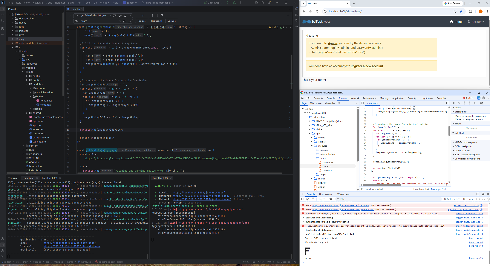

For testing getTableByTabletojson() and printImageFromTable()

Steps to run:

1. Launch terminal 1 and run: ./_r.sh
2. Launch terminal 1 and run: npm start
3. Chrome to open URL:
   http://localhost:9000/jd-test-base/

